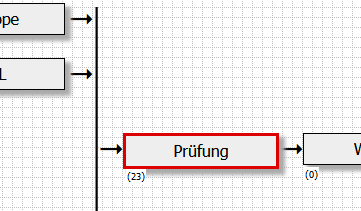
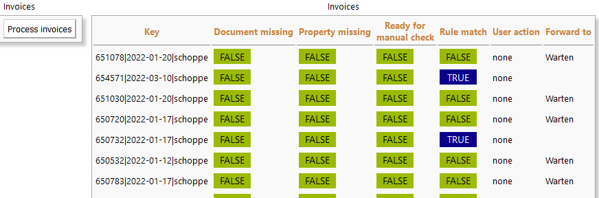
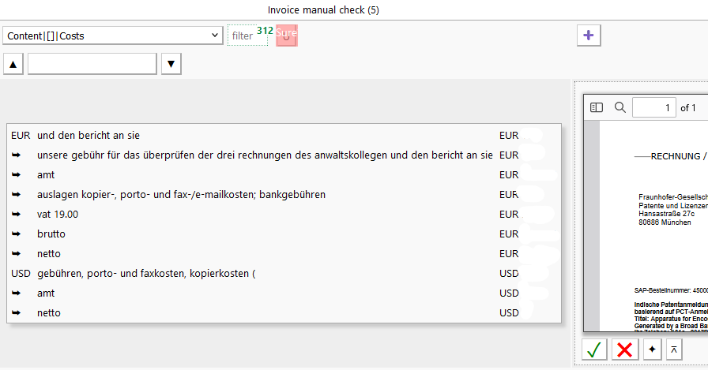
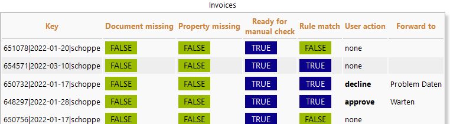

# Check entries
This is a datapool processor, i.e. the class implements the Datapool processor interface. The processor provides a user interface and data processing for the entry check by the user action. Rules are used to select relevant entries for manual checking.

# Example
A possible application is invoice checking. Invoices are selected for checking based on rules (e.g. if an invoice contains certain phrases or is above a threshold) and random. The relevant invoices are presented to the user on an invoice by invoice bases. The user can eigther accept or decline the invoice. Based on the user action the invoice is forwarded to specific targets, in the example accepted invoices and invoices that there not chosen based on the rules are forwarded to the canvas element selected by "Target success",e.g. "Warten" in the image.

Declined invoices will be forwarded to canvas element selected by "Target failure".

The next time the "Process invoices" button is clicked or the canvas element is triggered by the CanvbasProcessing job processed entries will be forwarded.

